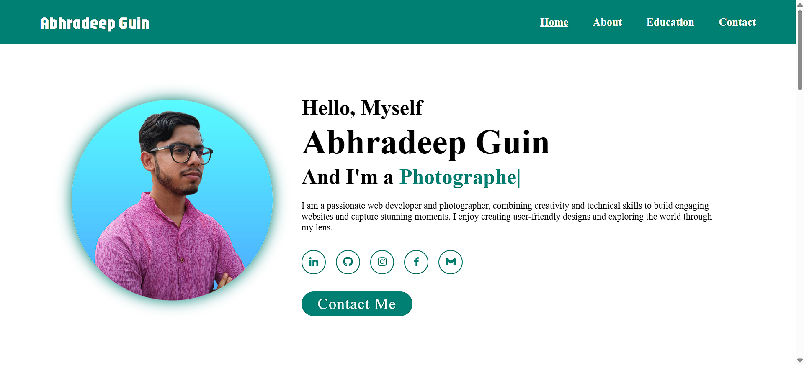
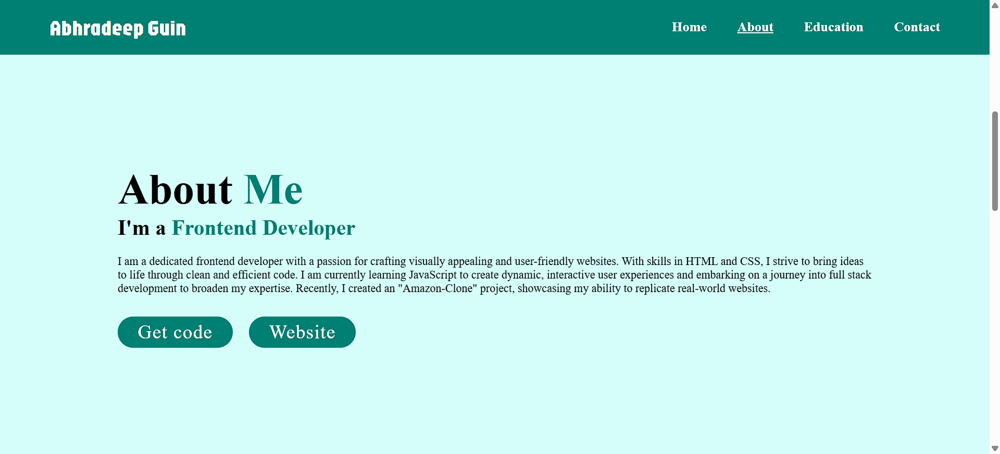
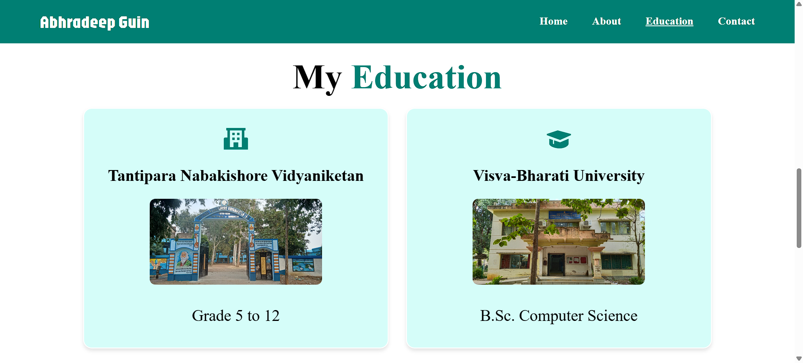

# Portfolio

Welcome to my **Personal Portfolio Website**! 🎉  
This project showcases my skills, projects, and journey as a **web developer** and **photographer**.

## 🌐 Live Demo
You can view the live website here: [Abhradeep Guin's Portfolio](https://deepabhra.github.io/portfolio/)

---

## 📂 Project Overview

This portfolio is a single-page website designed to provide insights about me, including:

- **Introduction**: A brief overview of who I am.
- **About Me**: My skills and ongoing journey in full-stack development.
- **Education**: My educational background.
- **Contact**: A form to connect with me directly.

---

## ✨ Features

- **Responsive Design**: Fully responsive across devices and screen sizes.
- **Interactive Navbar**: Highlights the current section as you scroll.
- **Social Links**: Direct links to my LinkedIn, GitHub, and more.
- **Dynamic Text Animation**: Using Typed.js for an engaging introduction.
- **Smooth Scrolling**: Navigation with a seamless scrolling effect.
- **Dark Mode**: Toggle between light and dark themes for a better viewing experience.

---

## 🛠️ Technologies Used

- **HTML**: For structuring the content.
- **CSS**: For styling and layout:
  - Responsive design with media queries.
  - Animations and hover effects.
  - Dark mode styling with CSS variables.
- **JavaScript**: For interactivity and dynamic features:
  - Navbar scroll detection.
  - Toggle menu functionality.
  - Typed.js integration.
  - Dark mode toggle functionality.

---

## 📸 Screenshots

### Home Section


### About Section


### Education Section


---

## 🚀 Setup Instructions

To run this project locally:

1. Clone the repository:
   ```bash
   git clone https://github.com/deepabhra/portfolio.git
